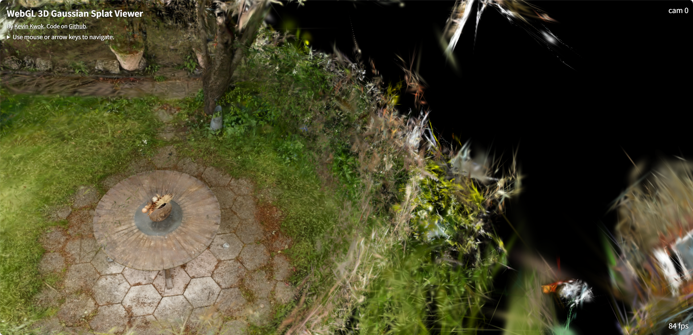
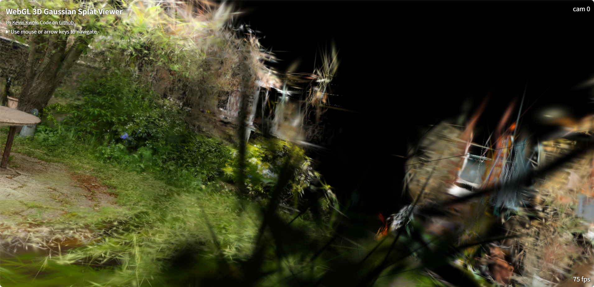
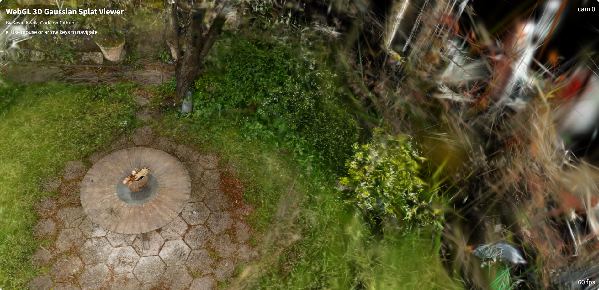
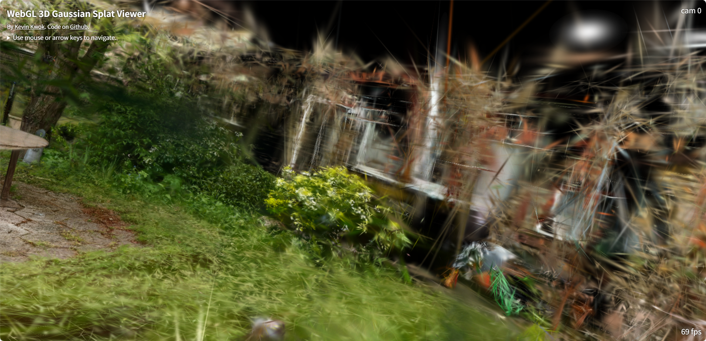
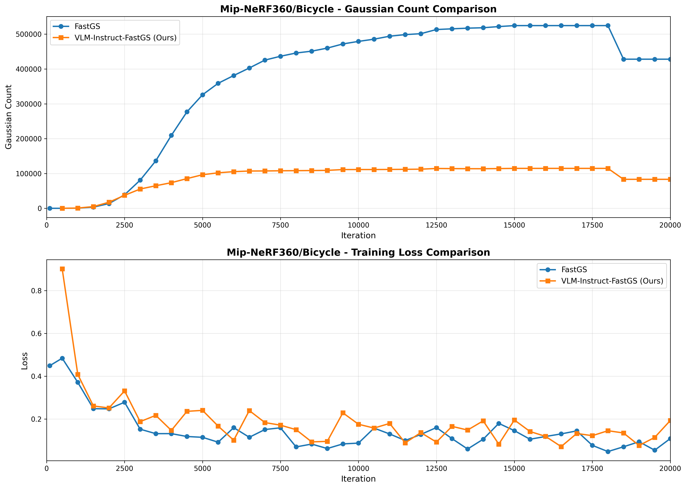
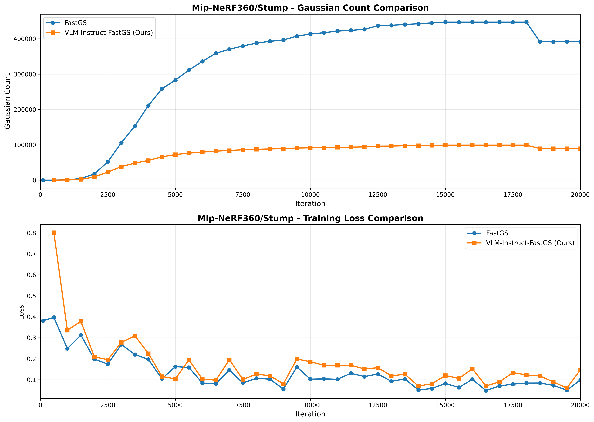
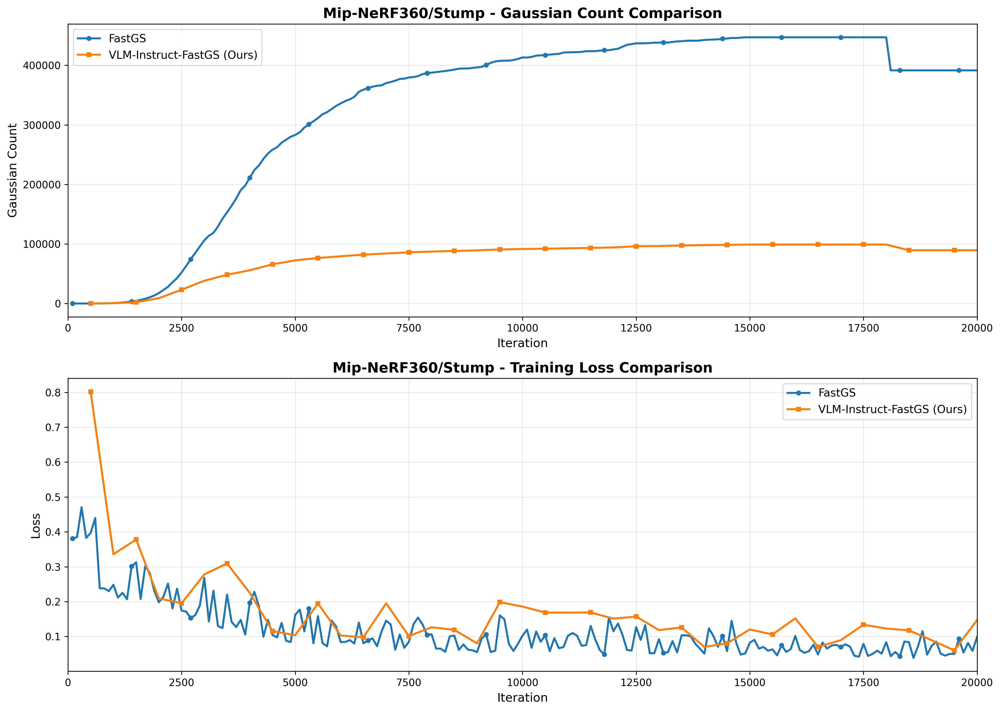

# VLM-Instruct-FastGS: Semantic Guidance for Complete Scene Reconstruction

## 📌 Overview
VLM-Instruct-FastGS enhances 3D Gaussian Splatting by incorporating semantic guidance from Vision-Language Models (VLMs) into the densification process. Under the same sparse initialization and within the same number of iterations, our method achieves more complete scene reconstruction through a multi-stage semantic guidance strategy:

- **Phase 1: Accelerated Detail Formation** – Identifies regions that are beginning to show texture detail, accelerating the reconstruction of main subjects during early training.
- **Phase 2: Background Completion** – Detects main subject regions using VLM understanding, then inverts these masks to obtain background areas requiring enhancement, ensuring full scene coverage.
- **Phase 3: Novel View Refinement** – Analyzes renders from unseen viewpoints to identify inconsistent or under-reconstructed regions, further improving rendering quality across the entire scene.

This semantic-aware approach enables comprehensive scene reconstruction without requiring additional iterations or manual annotation—with its advantages being particularly pronounced under random sparse initialization and during early training stages.

## 📊 Performance Comparison
Starting from only 100 random points and after 20,000 iterations, our method, powered by the [Qwen3-VL-2B-Instruct](https://huggingface.co/Qwen/Qwen3-VL-2B-Instruct) vision-language model, demonstrates significantly more complete scene reconstruction:

<div align="center"> <table> <tr> <td width="25%"><strong>Method</strong></td> <td width="37.5%"><strong>View 1</strong></td> <td width="37.5%"><strong>View 2</strong></td> </tr> <tr> <td><strong>FastGS</strong></td> <td></td> <td></td> </tr> <tr> <td><strong>VLM-Instruct-FastGS (Ours)</strong></td> <td></td> <td></td> </tr> </table> </div>

## 📊 Result
We evaluate our method on the Mip-NeRF 360 dataset, comparing training loss convergence against vanilla FastGS under the same sparse initialization (100 random points)

<div align="center"> <br> <em>Training loss comparison on Mip-NeRF 360 dataset - Overall convergence</em><br><br>


<em>Training loss comparison on Mip-NeRF 360 dataset - Phase details</em>




<em>Training loss comparison on Mip-NeRF 360 dataset - Final refinement</em>

</div>

Phase 1 (0–8,000 iterations): Rapidly reconstructs main scene subjects.

Phase 2 (8,000–14,000 iterations): Background Completion – Identifies and inverts main subject masks to target background areas, perfecting comprehensive scene coverage beyond foreground objects.

Pruning & Refinement (14,000–20,000 iterations):  Prunes redundant Gaussians to reduce computational burden.

## 🛠️ Preparation
### Download VLM Model
Download the [Qwen3-VL-2B-Instruct](https://huggingface.co/Qwen/Qwen3-VL-2B-Instruct) vision-language model and place it in the appropriate directory.
### Dataset Structure
Organize your single scene dataset as follows:
```bash
├── your_project/
│   ├── images/
│   ├── sparse/
│       └── 0/
│           ├── cameras.bin
│           └── images.bin
```
## 🚀 Training
### Basic Training Command
```bash
python train.py --source_path /path/to/your_project --model_path /path/to/output  --qwen_model_path /path/to/Qwen3-VL-2B-Instruct --save_region_vis
```
### ⚠️ Note:

1.VLM inference introduces computational overhead—carefully balance phase intervals and sampling frequency to maintain efficiency.

2.VLM predictions may produce overestimated region masks, potentially causing explosive Gaussian growth. Set appropriate max points limits per phase to control density.
### 📋 Command Line Arguments for train.py

<details>
<summary> Semantic Guidance</summary>

##### --semantic_num_samples
Number of images to analyze each time 

</details>

<details>
<summary> Phase 1: Accelerated Detail Formation</summary>

##### --phase1_start
Phase 1 start iteration 

##### --phase1_end
Phase 1 end iteration 

##### --phase1_interval
Phase 1 interval between analyses 

##### --phase1_max_points
Phase 1 max points per view 

</details>

<details>
<summary> Phase 2: Background Completion</summary>

##### --phase2_start
Phase 2 start iteration 

##### --phase2_end
Phase 2 end iteration 

##### --phase2_interval
Phase 2 interval between analyses

##### --phase2_max_points
Phase 2 max points per view 

</details>

<details>
<summary> Pruning & Refinement</summary>

##### --prune_protection
Iterations to protect after Phase 2 before pruning 

##### --total_iterations
Total training iterations 

</details>

## 🙏 Acknowledgements
This project is built upon [3DGS](https://github.com/graphdeco-inria/gaussian-splatting), [FastGS](https://github.com/fastgs/FastGS/tree/main?tab=readme-ov-file), and [Qwen3-VL-2B-Instruct](https://huggingface.co/Qwen/Qwen3-VL-2B-Instruct). We extend our gratitude to all the authors for their outstanding contributions and excellent repositories!

