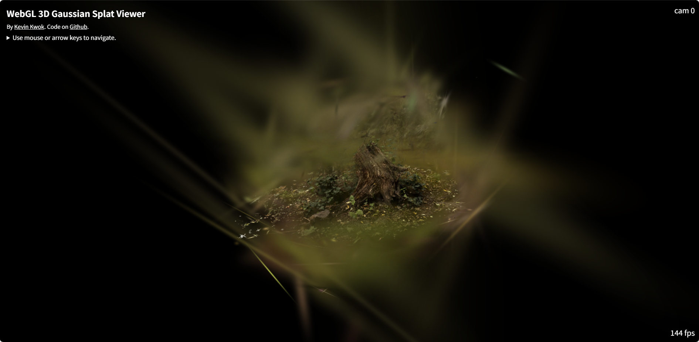
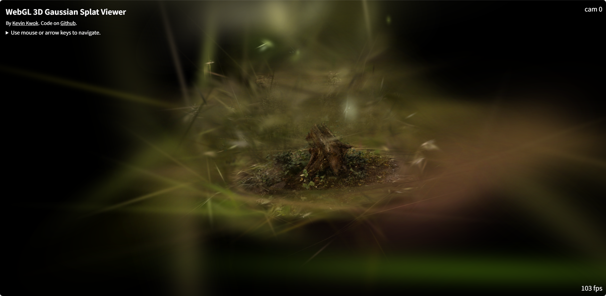

# VLM-Instruct-FastGS: Semantic Guidance for Complete Scene Reconstruction

## 📌 Overview
VLM-Instruct-FastGS (Vision-Language Model Guided 3D Gaussian Splatting) enhances 3D Gaussian Splatting by leveraging Vision-Language Models (VLMs) to intelligently guide the densification process. Under the same iteration budget, our method achieves more complete scene reconstruction through a three-phase semantic guidance strategy:

- **Phase 1: Accelerated Detail Formation** – Identifies regions that are beginning to show texture detail, accelerating the reconstruction of main subjects during early training.
- **Phase 2: Background Completion** – Detects main subject regions using VLM understanding, then inverts these masks to obtain background areas requiring enhancement, ensuring full scene coverage.
- **Phase 3: Novel View Refinement** – Analyzes renders from unseen viewpoints to identify inconsistent or under-reconstructed regions, further improving rendering quality across the entire scene.

This semantic-aware approach enables comprehensive scene reconstruction without requiring additional iterations or manual annotation.

## 📊 Performance Comparison
Starting from only 100 random points and after just 2,000 iterations, our method, powered by the [Qwen3-VL-2B-Instruct](https://huggingface.co/Qwen/Qwen3-VL-2B-Instruct) vision-language model, demonstrates significantly more complete scene reconstruction:

 <table> <tr> <td width="20%"><strong>FastGS</strong></td> <td width="26.7%"></td> <td width="26.7%"></td> <td width="26.7%"></td> </tr> <tr> <td><strong>VLM-Instruct-FastGS (Ours)</strong></td> <td></td> <td></td> <td></td> </tr> </table> 

With the same sparse initialization and iteration budget, VLM-Instruct-FastGS builds substantially more scene structure—particularly in background regions. The semantic guidance enables the model to allocate Gaussians more intelligently, resulting in more comprehensive scene coverage from the very early stages of training.

## 📊 Result
We evaluate our method on the Mip-NeRF 360 dataset, comparing training loss convergence against vanilla FastGS under the same sparse initialization (100 random points)

    <em>Training loss comparison on Mip-NeRF 360 dataset</em> 

