# VLM-Instruct-FastGS: Semantic Guidance for Complete Scene Reconstruction

### 🚧 Still under editing...

## 📌 Overview
VLM-Instruct-FastGS enhances 3D Gaussian Splatting by incorporating semantic guidance from Vision-Language Models (VLMs) into the densification process. Under the same sparse initialization and within the same number of iterations, our method achieves more complete scene reconstruction via a semantic guidance strategy:

- **Phase 0: Early Main Region Reconstruction** – Quickly establishes the primary scene region from multi-view cues at the initial stage.
- **Phase 1: Ambient Initialization and Background Completion** – Wraps the main subject with an oblique hollow elliptical tube for environment initialization and subsequent background training, covering ceilings/sky and ground while keeping the subject visible in partial views.
- **Phase 2: VLM-Guided Targeted Optimization** – Leverages VLMs to identify underperforming regions in rendered images, enabling targeted refinement for enhanced scene quality.
  
By progressively conducting subject-centric reconstruction, ambient initialization, and semantic-aware refinement, our framework effectively improves the completeness and quality of 3D scene reconstruction, especially under sparse inputs and in early training phases.

## 🔍 More Details
The following table illustrates the progressive reconstruction process: starting from the output of Phase 0, we apply Hollow Elliptical Tube Initialization to initialize the surrounding environment, followed by the evolution of Phase 1 reconstruction across different iterations. It highlights the effectiveness of our proposed initialization strategy:

<div align="center"> 
  <table> 
    <tr> 
      <td width="20%"></td> <!-- 留空单元格 -->
      <td width="16%"><strong>Result from Phase 0</strong></td> 
      <td width="16%"><strong>Hollow Elliptical Tube Initialization</strong></td> 
      <td width="16%"><strong>Phase 1 (1000 iters)</strong></td> 
      <td width="16%"><strong>Phase 1 (2000 iters)</strong></td> 
      <td width="16%"><strong>Phase 1 (3000 iters)</strong></td> 
    </tr> 
    <tr> 
      <td><strong>Mip-NeRF360/garden</strong></td> 
      <td>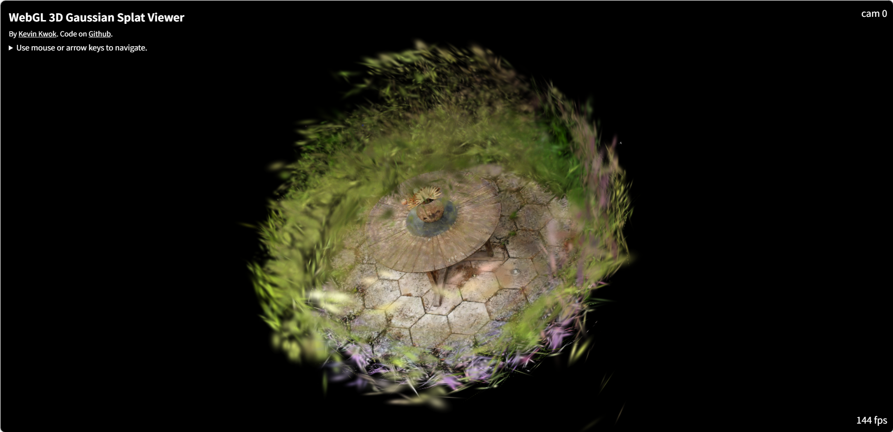</td> 
      <td>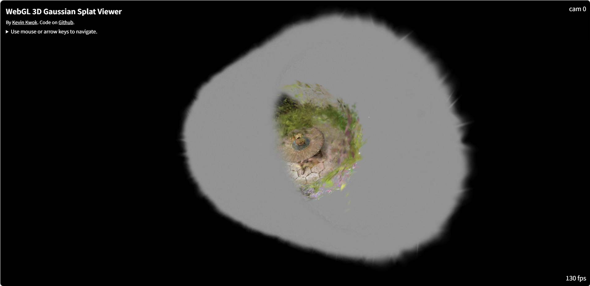</td> 
      <td>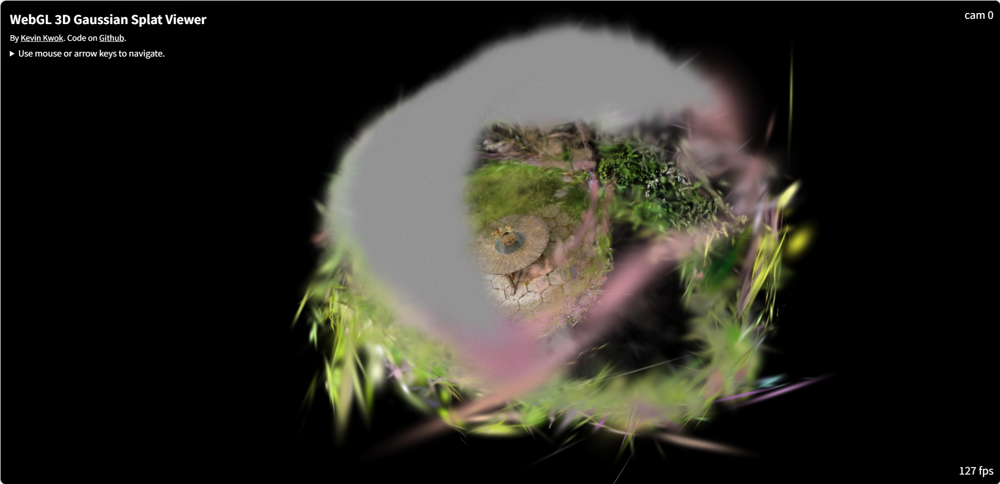</td> 
      <td>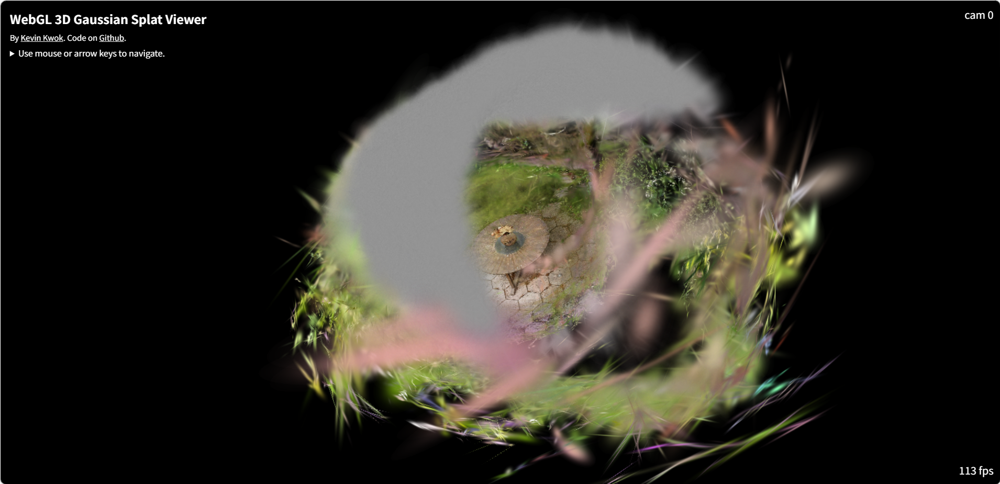</td> 
      <td>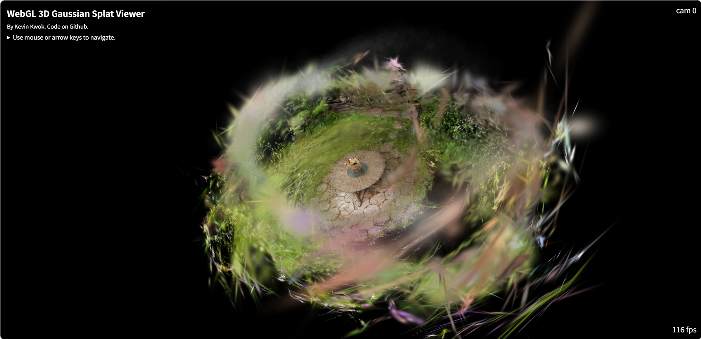</td> 
    </tr> 
    <tr> 
      <td><strong>Mip-NeRF360/counter</strong></td> 
      <td>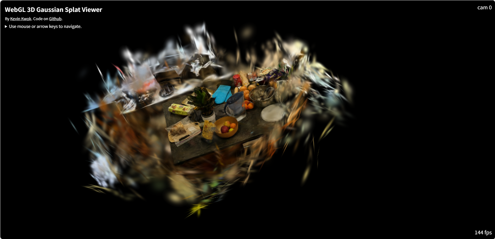</td> 
      <td>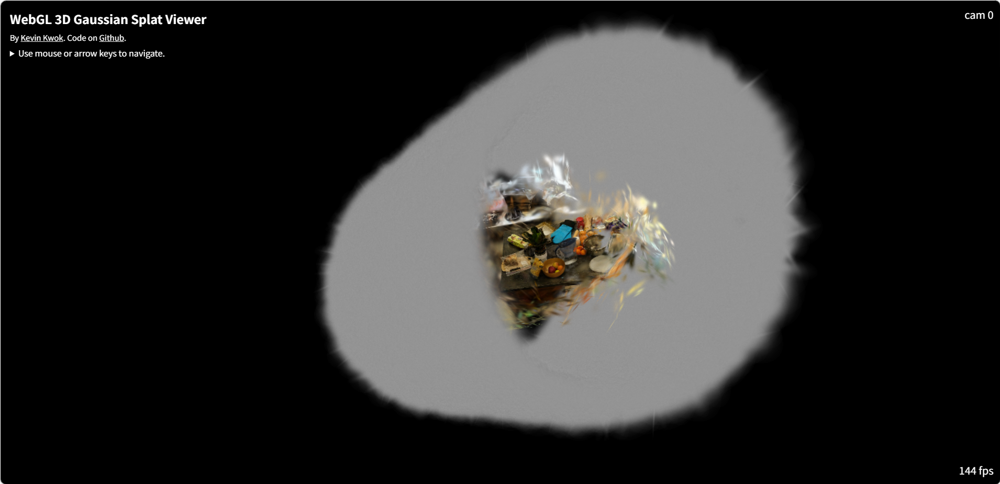</td> 
      <td>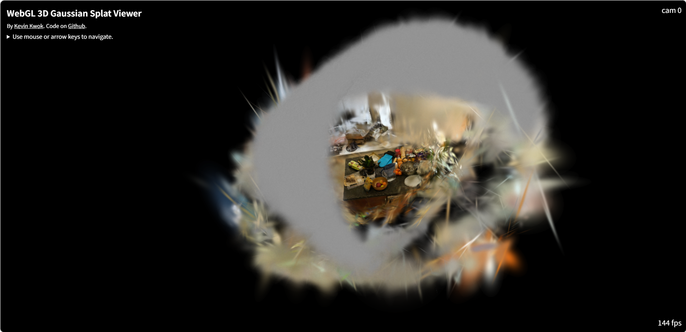</td> 
      <td>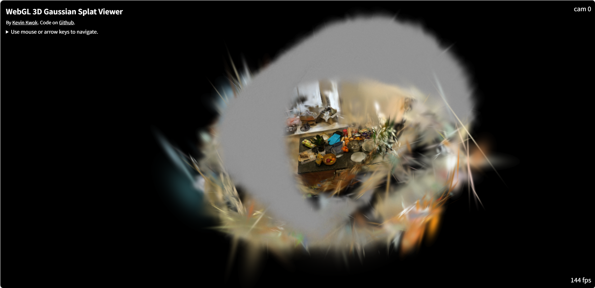</td> 
      <td>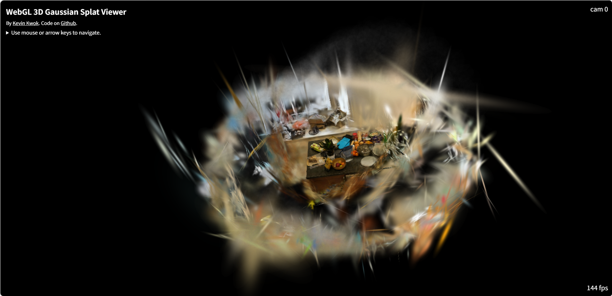</td> 
    </tr> 
  </table> 
</div>

### Hollow Elliptical Tube Initialization:
### We propose to wrap the main subject with a hollow elliptical tube for surrounding environment initialization.
#### a. It covers not only the surrounding areas but also the sky/ceiling and ground.
#### b. Compared with full box-shaped enclosing strategies, it keeps the subject visible in partial views.

<br>
<div align="center">
  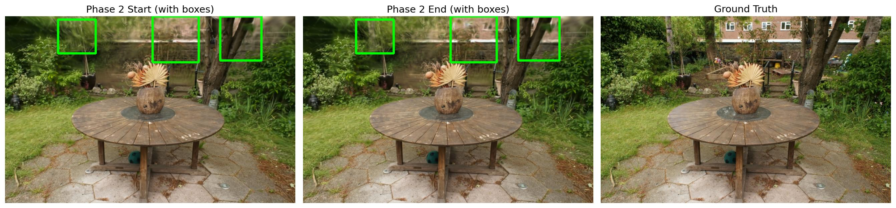
  <br><br>
  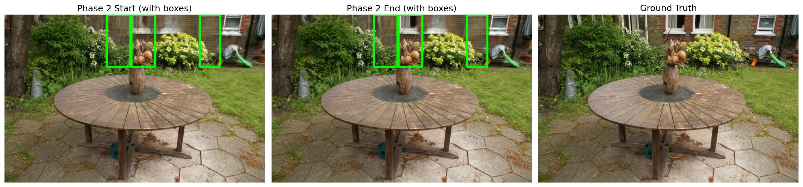
  <br><br>
  <strong>Phase 2: VLM-Guided Targeted Optimization</strong>
</div>
<br>

Phase 2 leverages Vision-Language Models (VLMs) to detect underperforming regions in rendered images, and then performs targeted optimization on these regions to further improve the overall scene reconstruction quality.

## 📊 Performance Comparison
Starting from only 100 random points and after 20,000 iterations, our method, powered by the [Qwen3-VL-2B-Instruct](https://huggingface.co/Qwen/Qwen3-VL-2B-Instruct) vision-language model, demonstrates significantly more complete scene reconstruction:

<div align="center"> <table> <tr> <td width="25%"><strong>Method</strong></td> <td width="37.5%"><strong>View 1</strong></td> <td width="37.5%"><strong>View 2</strong></td> </tr> <tr> <td><strong>FastGS</strong></td> <td>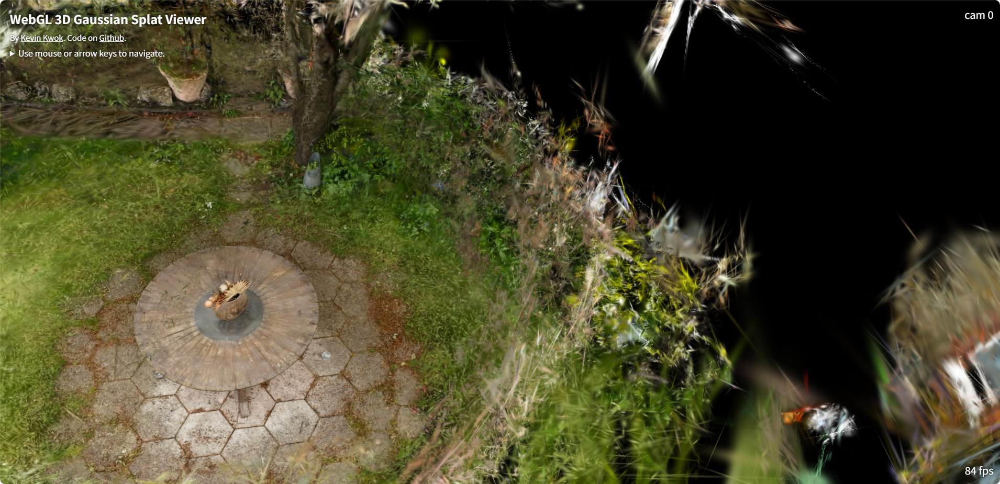</td> <td>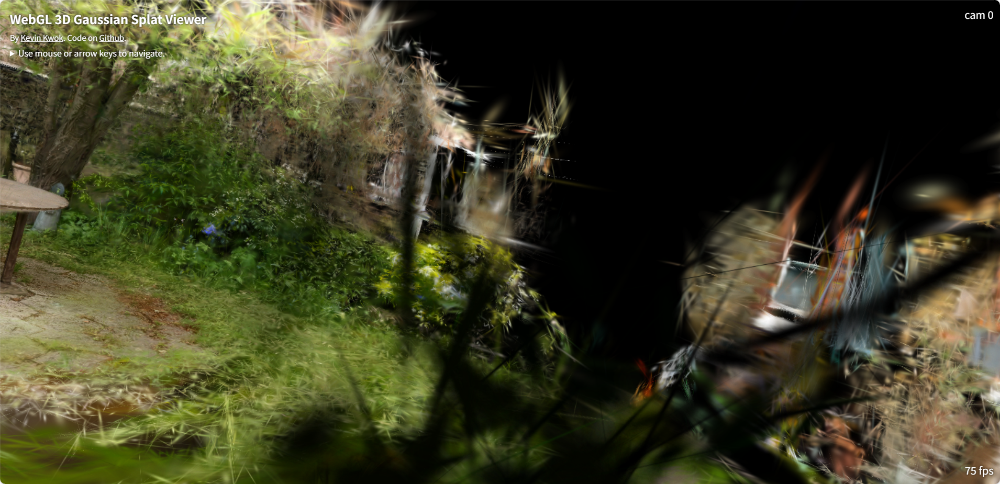</td> </tr> <tr> <td><strong>VLM-Instruct-FastGS (Ours)</strong></td> <td>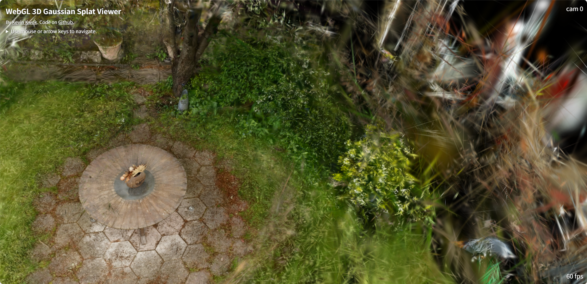</td> <td>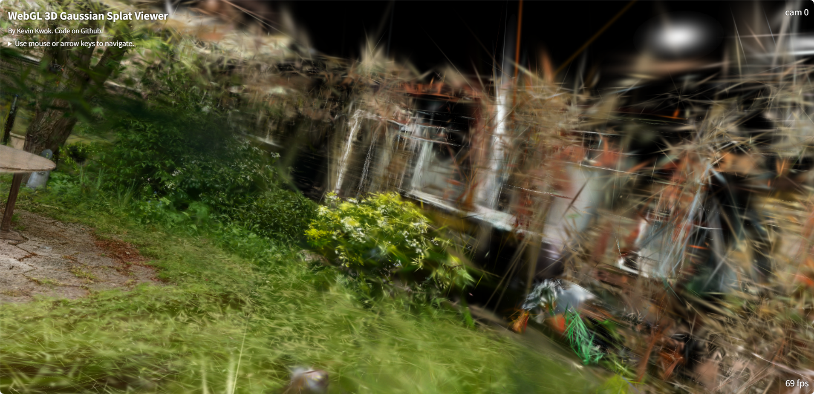</td> </tr> </table> </div>

## 📊 Result
We evaluate our method on the Mip-NeRF 360 dataset, comparing Gaussian count and training loss convergence against vanilla FastGS under the same sparse initialization (100 random points, 20,000 iterations).

<div align="center">
  <table style="width:100%; border-collapse: collapse;">
    <tr>
      <td style="padding: 2px; border: none; width: 50%;">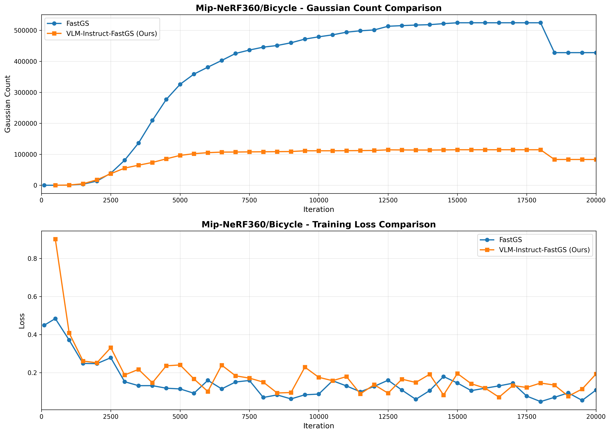</td>
      <td style="padding: 2px; border: none; width: 50%;">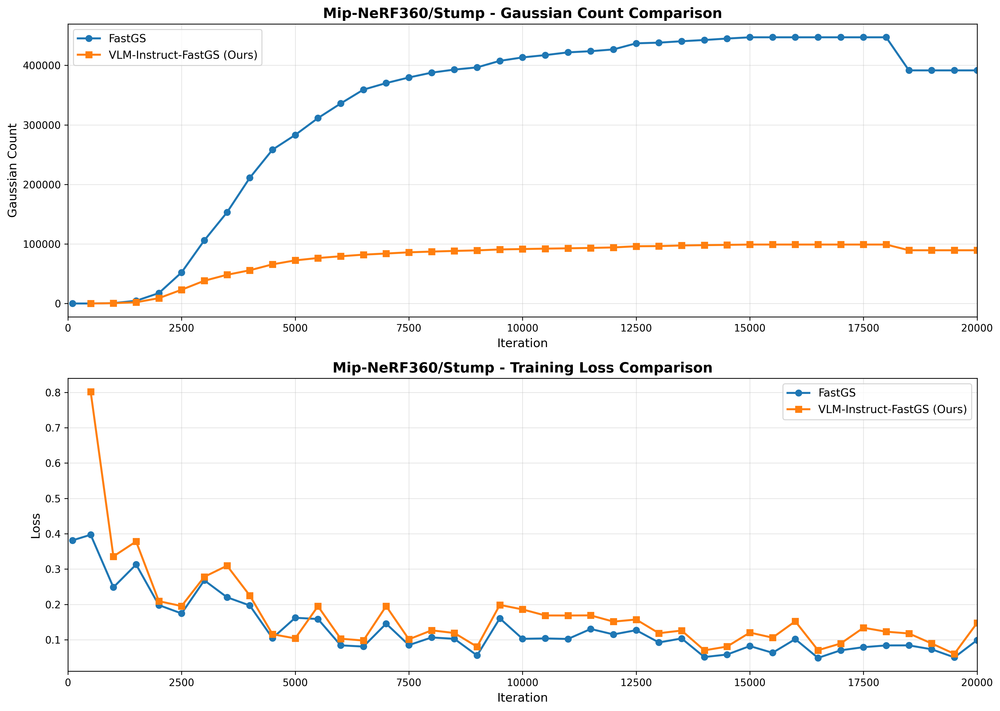</td>
    </tr>
    <tr>
      <td style="padding: 2px; border: none; width: 50%;">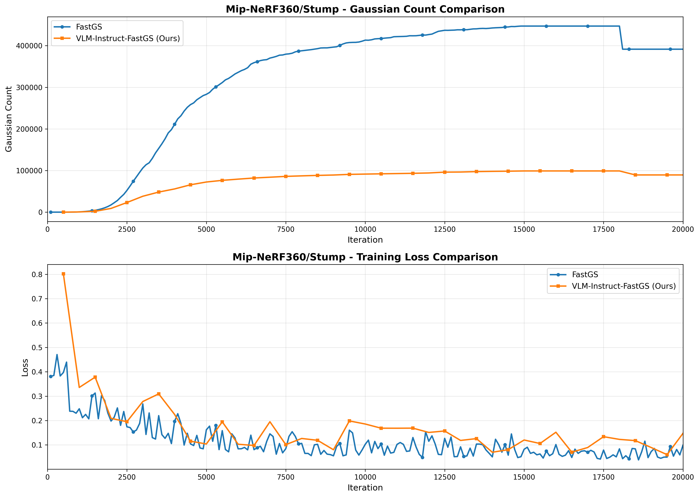</td>
      <td style="padding: 2px; border: none; width: 50%;">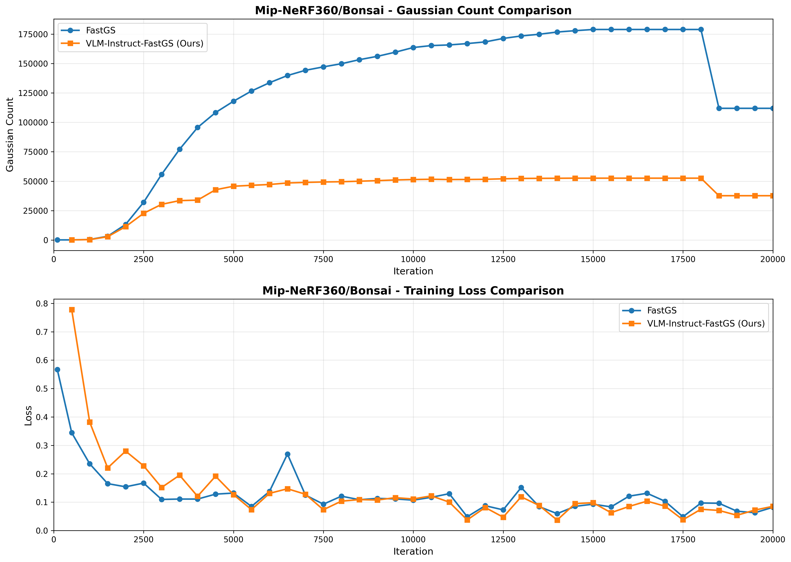</td>
    </tr>
  </table>
  <br>
  <em>Comparison of Gaussian count and training loss on Mip-NeRF 360 dataset.</em>
</div>
Phase 1 (0–8,000 iterations): Rapidly reconstructs main scene subjects.

Phase 2 (8,000–14,000 iterations): Background Completion – Identifies and inverts main subject masks to target background areas, perfecting comprehensive scene coverage beyond foreground objects.

Pruning & Refinement (14,000–20,000 iterations):  Prunes redundant Gaussians to reduce computational burden.

## 🛠️ Preparation
### Download VLM Model
Download the [Qwen3-VL-2B-Instruct](https://huggingface.co/Qwen/Qwen3-VL-2B-Instruct) vision-language model and place it in the appropriate directory.
### Dataset Structure
Organize your single scene dataset as follows:
```bash
├── your_project/
│   ├── images/
│   ├── sparse/
│       └── 0/
│           ├── cameras.bin
│           └── images.bin
```
## 🚀 Training
### Basic Training Command
```bash
python train.py --source /path/to/your_project --model_path /path/to/output  --qwen_model_path /path/to/Qwen3-VL-2B-Instruct 
```


## 🙏 Acknowledgements
This project is built upon [3DGS](https://github.com/graphdeco-inria/gaussian-splatting), [FastGS](https://github.com/fastgs/FastGS/tree/main?tab=readme-ov-file), and [Qwen3-VL-2B-Instruct](https://huggingface.co/Qwen/Qwen3-VL-2B-Instruct). We extend our gratitude to all the authors for their outstanding contributions and excellent repositories!

